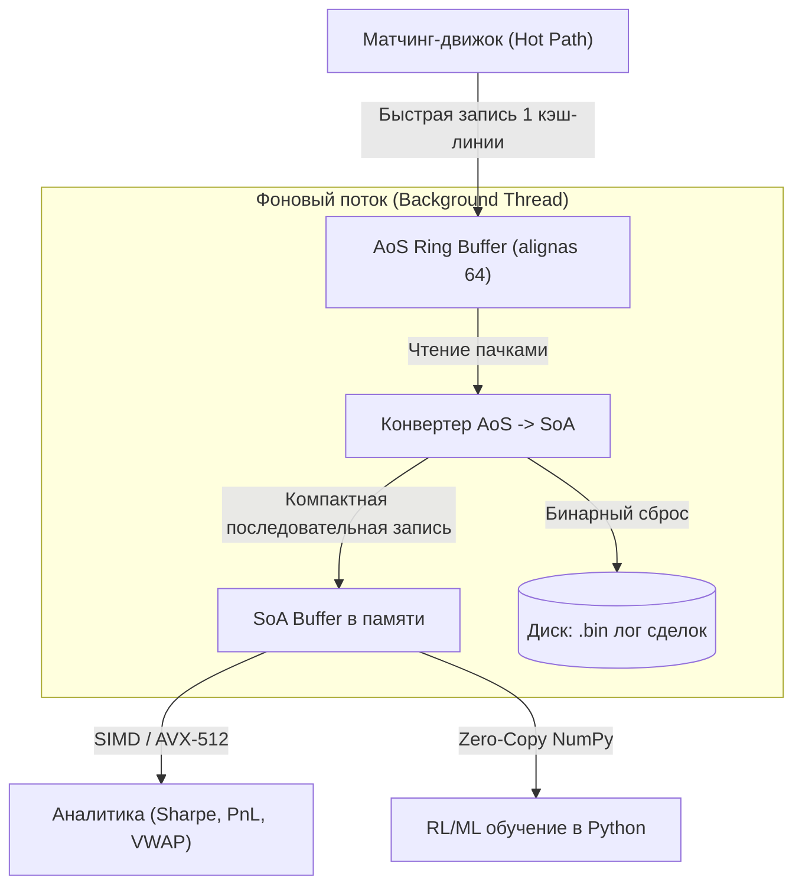

# Low-Latency & Core Engine Optimization Ideas for YABE

Этот файл содержит список архитектурных и низкоуровневых оптимизаций, направленных на снижение задержек (low-latency), устранение джиттера (jitter reduction) и повышение эффективности использования кэша процессора.

---

## 🚀 1. Оптимизация стакана (L3 Limit Order Book)

### 1.1 Переход на Flat Linked List на предвыделенном пуле (Object Pool)
* **Проблема:** Сейчас в `PriceLevel` используется `std::list<Order>`. Каждая новая заявка вызывает `operator new` (динамическую аллокацию в куче) на горячем пути, а также приводит к промахам по кэшу (L1/L2 cache misses) из-за разбросанных в памяти нод списка (pointer chasing).
* **Решение:** Использовать предвыделенный пул структур фиксированного размера (`Object Pool`) и целочисленную индексную адресацию:
  ```cpp
  struct OrderNode {
      Order data;
      uint32_t next_idx;
      uint32_t prev_idx;
  };
  std::array<OrderNode, MAX_ORDERS> order_pool;
  ```
  Это позволит сохранить временную сложность операций вставки/удаления/FIFO матчинга за $O(1)$, но полностью устранит динамическую аллокацию памяти на горячем пути (Zero-Allocation Hot Path).

### 1.2 Выравнивание структур данных по строкам кэша (Cache-Line Alignment)
* **Проблема:** Размер `struct Order` составляет 40 байт. В плоском массиве или векторе элементы ордеров будут пересекать границы 64-байтных строк кэша (cache line crossing), из-за чего для чтения одного ордера процессору придется загружать две строки кэша.
* **Решение:** 
  * Использовать `alignas(64)` для критических структур, которые должны занимать ровно одну строку кэша.
  * Упорядочить поля по убыванию их размера (выравнивания) для минимизации компиляторного padding: сначала все 8-байтовые переменные (`id`, `qty`, `ts`), затем более мелкие.

### 1.3 Использование Struct-of-Arrays (SoA) для расчета признаков (Feature Calculation)
* **Проблема:** Для расчета микроструктурных фич (например, Queue Imbalance, среднего возраста ордеров в очереди) требуется сканировать свойства ордеров. При AoS (Array of Structures) процессор загружает лишние поля ордера в кэш.
* **Решение:** Выделить свойства ордеров в параллельные плоские массивы:
  ```cpp
  struct PriceLevelSoA {
      std::vector<uint64_t> ids;
      std::vector<uint64_t> quantities;
      std::vector<uint64_t> timestamps;
  };
  ```
  При расчете фич сканируются только нужные массивы (например, `quantities`), что позволяет процессору использовать векторные инструкции SIMD (AVX-512) и обрабатывать данные со скоростью памяти.

### 1.4 Микро-оптимизации PolymarketOrderBook
* **Проблема:** В текущей реализации `PolymarketOrderBook` присутствуют рантайм-ветвления (`if` при разделении 64-битных масок и тернарные операторы выбора стороны сделки). Объемы в формате `double` раздувают кэш-футпринт стакана до 1632 байт.
* **Решение:**
  * **Branchless битовые маски:** Заменить раздельные `uint64_t` `low`/`high` маски на единую 128-битную маску `unsigned __int128`. Это позволит выполнять установку и сброс бит без условных переходов (`if`).
  * **Шаблонизация по Side:** Сделать метод `apply_delta` шаблонным по `<Side side>` для генерации компилятором отдельных мономорфных функций под покупку/продажу без рантайм-проверок стороны.
  * **Сжатие кэш-футпринта:** Перевести хранение объемов с `double` (8 байт) на `float` (4 байта), снизив размер стакана с 1632 до 832 байт (в 2 раза меньше занимаемых кэш-линий).

### 1.5 Оптимизация L2OrderBook (Zero-Allocation & Linear Search)
* **Проблема:** 
  1. `L2OrderBook` использует динамически аллоцируемые `std::vector<Level>` для хранения bids и asks. Хотя в конструкторе вызывается `reserve()`, это все равно создает зависимость от кучи и риски реаллокаций при изменении конфигурации глубины.
  2. Для поиска ценовых уровней используется `std::lower_bound` (бинарный поиск). Для неглубоких стаканов (например, Top-10 / Top-20) бинарный поиск генерирует лишние ветвления и промахи по кэшу из-за непоследовательных прыжков по памяти.
* **Решение:**
  * **Шаблонный статический вектор:** Заменить `std::vector<Level>` на предвыделенный на стеке (или внутри структуры) контейнер фиксированного размера, например `boost::container::static_vector<Level, MaxLevels>` или кастомную легковесную обертку над `std::array`.
  * **Адаптивный поиск (Linear vs Binary):** Заменить бинарный поиск на простой линейный сканер при глубине стакана $N \le 16$. Линейный поиск отлично векторизуется компилятором (SIMD) и утилизирует последовательный доступ к памяти процессора.

### 1.6 Оптимизация MatchingBook (Free List, Robin Hood Hashing & Sorted Price Levels)
* **Проблема:** 
  1. Метод `find_free_order_slot` выполняет линейный поиск по всему массиву `orders_` с временной сложностью $O(N)$, где $N$ — `OrderCapacity`. Это критическое узкое место при больших размерах стакана.
  2. Поиск уровня цен в `find_level` и `find_or_create_level` также является линейным $O(M)$ по всему массиву `levels_`.
  3. В закрытой хэш-таблице `index_` при частых отменах ордеров накапливаются "могильники" (`IndexState::Deleted`), из-за чего со временем поиск отсутствующего ордера деградирует до $O(\text{Capacity})$.
* **Решение:**
  * **Индексный Free List:** Добавить статический стек свободных индексов (`std::array<std::size_t, OrderCapacity> free_slots_` с указателем вершины). Извлечение и возврат слота будут выполняться за строгое $O(1)$.
  * **Сортированный индекс уровней цен:** Вместо линейного сканирования поддерживать отсортированный массив индексов активных уровней цен отдельно для bids и asks. Это позволит выполнять бинарный поиск за $O(\log M)$ или находить лучшие уровни за $O(1)$ из головы списка.
  * **Robin Hood Hashing с Backward Shift Deletion:** Избавиться от могильников (`Deleted`) в хэш-индексе, сдвигая конфликтующие элементы назад при удалении. Это сохранит высокую скорость поиска и предотвратит деградацию таблицы со временем.

---

## 🧮 2. Математика и числовые типы

### 2.1 Перевод стакана на Fixed-Point Arithmetic (целочисленные тики и лоты)
* **Проблема:** Использование `double price` в `Order` и `PriceLevel` небезопасно для логики сведения (matching engine) из-за погрешностей округления стандарта IEEE-754 (например, дробь `0.1` не может быть представлена точно в двоичной системе).
* **Решение:** Представлять цену и объемы как целочисленные тики (ticks) и лоты (lots) (`std::int64_t`), масштабированные на коэффициент площадки (например, $10^8$ для криптобирж). Все проверки цен заменить на целочисленное сравнение.

---

## 🧵 3. Инфраструктурные компоненты

### 3.1 Замена `std::unordered_map` во внешних индексах
* **Проблема:** Дефолтный `std::unordered_map` (используемый для быстрого поиска ордеров по `OrderID`) имеет бакетную структуру на базе связанных списков с указателями. Это вызывает промахи по кэшу и аллокации при коллизиях.
* **Решение:** Использовать плоские хеш-таблицы с открытой адресацией (Open Addressing / Flat Hash Maps), например, `flat_hash_map` из библиотеки Abseil или кастомную таблицу фиксированного размера без цепочек конфликтов.

### 3.2 Зеркальный кольцевой буфер и Zero-Copy NumPy для Python биндингов
* **Проблема:** Передача состояний стакана в Python через стандартный механизм `pybind11` на каждом тике приводит к колоссальным накладным расходам на выделение Python-объектов (`PyObject`), работу GC (сборщика мусора) и блокировки GIL.
* **Решение:**
  * Реализовать статический Top-N стакан (например, Depth-10) на базе `std::array` и сортировки вставками (Insertion Sort).
  * Выделять на стороне C++ непрерывный кольцевой буфер истории снимков стакана.
  * Экспортировать этот буфер в Python как **NumPy Memory View** (`py::array_t`) без копирования данных. Python-стратегия (или RL-модель) считывает последние срезы стакана напрямую из разделяемой памяти C++, сводя накладные расходы на интероперабельность к нулю.

### 3.3 Оптимизация структуры Trade (Hybrid AoS-SoA Trade Pipeline)
* **Проблема:** Хранение истории сделок в формате AoS (`std::vector<Trade>`) неэффективно для расчета торговых метрик (VWAP, реализованный PnL, волатильность), так как процессор загружает в кэш ненужные ID участников, снижая пропускную способность памяти. Однако ведение истории сразу в SoA на горячем пути замедляет запись (scatter writes к нескольким массивам).
* **Решение (Гибридный конвейер):**
  * **Hot Path (AoS):** Матчинг-движок пишет сделки в предвыделенный `alignas(64) Trade` кольцевой буфер (AoS). Это обеспечивает максимальную скорость записи за 1 кэш-линию и исключает ложное разделение кэша (false sharing).
  * **Trade SoA для аналитики:** Для хранения истории сделок в бэктестере использовать схему Struct-of-Arrays (отдельные непрерывные векторы для `prices`, `quantities` и `timestamps`). Это позволит компилятору использовать SIMD/FMA инструкции для расчета метрик (например, VWAP) на максимальной скорости.
  * **Выравнивание Trade по границе кэш-линии:** Добавить `alignas(64)` для структуры `Trade` при передаче через Lock-free буферы, чтобы гарантировать атомарность записи и исключить cache line bouncing между потоками.

### 3.4 Оптимизация выравнивания ScheduledEvent (Eliminate Padding)
* **Проблема:** Структура события симулятора `ScheduledEvent` из-за неоптимального порядка полей содержит 20 байт компиляторного паддинга (wasted space), раздувая размер со 136 до 152 байт. Это приводит к лишнему копированию памяти при операциях перемещения (swap, push_heap, pop_heap) в приоритетной очереди планировщика.
* **Решение:** Реорганизовать порядок объявлений полей по убыванию их требований к выравниванию (от 8-байтовых к 1-байтовым), сократив размер структуры до чистых 136 байт и оптимизировав пропускную способность кэша L1/L2.

### 3.5 Внедрение сильной типизации идентификаторов (Strongly-Typed simulator IDs)
* **Проблема:** Псевдонимы типов `using AgentID = std::uint32_t`, `MarketID`, `OrderID` не защищают от ошибок неявного смешивания идентификаторов. Разработчик может перепутать порядок аргументов в функциях симулятора, и компилятор успешно соберет некорректный код.
* **Решение:** Заменить псевдонимы на компактные структуры-обертки с явными конструкторами (аналогично `TokenId` в `PolymarketTypes.hpp`). Это обеспечит строгую проверку типов на этапе компиляции (Quality Control) с нулевыми накладными расходами времени выполнения.

### 3.6 Оптимизация метаданных манифестов (Замена std::string на FixedString)
* **Проблема:** Использование `std::string` в `AssetManifestEntry` и `ProductManifestEntry` приводит к компиляторному паддингу (до 10 байт на структуру), риску динамических аллокаций в куче (при превышении лимита SSO) и нелинейному копированию памяти.
* **Решение:** Заменить `std::string` на плоский массив символов `std::array<char, 16>` (или компактную обертку `FixedString<16>`).
* **Оценка метрик:**
  * **Критичность:** **Средняя** (напрямую не влияет на горячий цикл матчинга, но важно для чистоты памяти и предотвращения фрагментации кучи на этапе запуска).
  * **Сложность реализации:** **Низкая** (простая замена типов в структурах и парсерах).
  * **Эффект на Latency:** **Низкий/Средний** (уменьшает размер `AssetManifestEntry` с 40 до 24 байт, улучшая L1/L2 cache locality при сканировании списка продуктов).

### 3.7 Статический полиморфизм (CRTP) для OrderGateway
* **Проблема:** Текущий базовый класс `OrderGateway` использует `virtual` методы (`submit_order`, `cancel_order`) для интеграции с биржами и симуляторами. На горячем пути выполнения стратегии это порождает оверхед виртуальной таблицы (vtable lookup) и непрямые переходы (indirect jumps), которые приводят к сбросу конвейера предсказания переходов CPU и промахам по кэшу инструкций.
* **Решение:** Использовать паттерн CRTP (Curiously Recurring Template Pattern) для статического полиморфизма на этапе компиляции:
  ```cpp
  template <typename Implementation>
  class OrderGateway {
  public:
      std::uint64_t submit_order(...) {
          return static_cast<Implementation*>(this)->impl_submit_order(...);
      }
  };
  ```
  Это позволит компилятору инлайнить вызовы отправки и отмены ордеров, полностью устраняя рантайм-оверхед vtable.

### 3.8 Устранение паддинга в OMS-структурах и FillEvent
* **Проблема:** Структуры `OrderRequest`, `OrderExecutionReport`, `OrderGroupResult`, `MarketSnapshot` и `FillEvent` содержат до 35.7% бесполезного паддинга из-за неоптимального расположения полей (например, `AssetID` (2 байта) перед `order_id` (8 байт) в `FillEvent` создает 6 байт пустоты). Это раздувает размер структур, нагружает шину памяти и снижает cache locality.
* **Решение:** Переупорядочить поля структур по убыванию выравнивания (8 -> 4 -> 2 -> 1 байт).
  * В `FillEvent` разместить: `order_id` (8), `price` (8), `quantity` (8), `timestamp` (8), `asset_id` (2), `side` (1), `liquidity_role` (1). Это сожмет структуру с 56 байт до 40 байт без единого байта паддинга (выигрыш 28.5% памяти и пропускной способности шины).
  * Проверить и переупорядочить остальные структуры Блока 1 и Блока 2.

### 3.9 Оптимизация PendingOrderMinHeap (Indirection / Pointer Heap)
* **Проблема:** Структура `PendingOrder` занимает около 48-56 байт. При балансировке кучи (`push` и `pop` в `PendingOrderMinHeap`) происходит частый вызов `std::swap` для целых структур. Это создает большую нагрузку на L1-кэш и процессор из-за лишнего копирования десятков байт за раз.
* **Решение:** Поддерживать кучу как плоский массив индексов `std::array<std::uint16_t, Capacity> heap_indexes_`, указывающий на элементы в статическом массиве структур `std::array<PendingOrder, Capacity> orders_`. Балансировка кучи будет переставлять только 2-байтовые индексы `std::uint16_t`, полностью устраняя избыточное копирование полей `PendingOrder`.

### 3.10 Замена std::unordered_map на Direct Addressing в ReplaySequenceValidator
* **Проблема:** В `ReplaySequenceValidator` для отслеживания состояния валидации последовательности (`ProductState`) по парам используется `std::unordered_map`. Это приводит к хэшированию на горячем пути валидации каждого пакета и риску промахов по кэшу из-за нодовой структуры стандартной хэш-таблицы.
* **Решение:** Использовать непрерывный плоский массив `std::array<ProductState, MaxProducts>` с прямой адресацией (Direct Addressing) по компактным сквозным индексам инструментов, снижая время доступа до строгого $O(1)$ с отличным cache locality.

### 3.11 Оптимизация EventMerger (Zero-Allocation Heap Storage)
* **Проблема:** В `EventMerger` для динамического K-way слияния потоков свыше 4 штук используется `std::priority_queue` поверх `std::vector`. Это сохраняет зависимость от кучи и оверхед по динамической памяти.
* **Решение:** Заменить `std::vector` на статический `std::array<HeapNode, N>` с ручным вызовом функций `std::push_heap` и `std::pop_heap`. Так как число потоков слияния $N$ константно и известно на этапе компиляции, это полностью переведет хранилище кучи на стек.




---

## 🗺️ 4. Дорожная карта (Roadmap) развития движка

### 4.1 Унификация L3 стакана (UnifiedMatchingBook)
* **Решение:** Провести рефакторинг текущей оптимизированной структуры `lob::sim::MatchingBook` в единый шаблонный компонент `UnifiedMatchingBook`, работающий на предвыделенных пулах (`std::array`) и плоских индексах. Этот стакан заменит все старые реализации.
* **Политика поиска уровней (Dual Search Policy):** Для оптимального баланса скорости при разной глубине данных внедрить два режима поиска уровней:
  * **Режим малого стакана (Shallow/Top-N):** При малой глубине данных (до 20–50 уровней) поиск уровня осуществляется простым линейным сканированием массива в L1 кэше. Это даёт максимальную скорость за счёт автовекторизации компилятором и отсутствия накладных расходов на хэширование.
  * **Режим глубокого стакана (Deep/Full-Depth):** При большой глубине данных поиск уровня происходит за $O(1)$ через плоскую хеш-таблицу без аллокаций (Flat Hash Map), а упорядоченность уровней поддерживается через плоский Skip List или B-Tree на массиве.


### 4.2 Депрекация и удаление легаси-стаканов (Clean Code Cleanup)
* **Решение:** Полностью удалить из кодовой базы неэффективные реализации:
  * `lob::OrderBook` (медленный стакан на базе `std::list` и `std::map`).
  * `lob::L2OrderBook` (стакан на базе динамически изменяемых `std::vector` с копированием при сдвигах).
* **Результат:** Устранение дублирования кода, упрощение поддержки биндингов и гарантия того, что любой путь исполнения в YABE (бэктест, симуляция, арбитраж) по умолчанию работает на максимальной скорости.

### 4.3 Интеграция `MultiAssetBacktestEngine` с новым `UnifiedMatchingBook`
* **Проблема:** Мультивалютный движок бэктестирования `MultiAssetBacktestEngine` в данный момент использует медленную базовую версию `OrderBook` на базе `std::list` и `std::map`, что приводит к просадкам производительности при симуляции множества параллельных торговых пар.
* **Решение:** Провести рефакторинг `MultiAssetBacktestEngine`, заменив базовый стакан на массив экземпляров `UnifiedMatchingBook` (по одному на каждый актив). Это позволит проводить высокопроизводительное мультивалютное тестирование с оркестрацией нескольких стратегий на нулевых аллокациях.

### 4.4 Проброс нового движка в Python
* **Проблема:** Самый быстрый симуляционный стакан и ядро `SimulationEngine` сейчас полностью изолированы в C++ и не доступны из Python-исследований.
* **Решение:** Добавить в `bindings.cpp` биндинги для `SimulationEngine` и `UnifiedMatchingBook`, используя паттерн *Zero-Copy NumPy Shared Memory Ring Buffer*, для управления быстрой симуляцией и оркестрацией стратегий из Python.

### 4.5 Унификация и очистка кошельков (Wallet Legacy Cleanup)
* **Решение:** Полностью удалить старый легаси-класс `lob::Wallet` (с жестко зашитыми USDT/BTC/ETH балансами). Вместо него перевести всю систему на оптимизированный `lob::DynamicWallet` (переименовав его в `UnifiedWallet` или `Wallet` после удаления старого).
* **Микро-оптимизации кошелька:**
  * **Flat POD Layout:** Заменить `std::vector<double>` внутри кошелька на `std::array<std::int64_t, MaxAssets>` для перевода балансов на fixed-point арифметику и исключения указателей на кучу (весь кошелек становится плоским POD размером около 128-256 байт).
  * **O(1) Cached Liquidation Routes:** Сейчас перевод активов в базовую валюту (ликвидация) при расчете NAV/риска происходит путем полного обхода графа ребер с вложенными циклами ($O(E^2)$). Необходимо кэшировать эффективные курсы конвертации для каждого актива при обновлении цен ребер, снижая сложность ликвидации на горячем пути до $O(1)$ (одно умножение на кэшированный коэффициент).
  * **Единый стандарт резервирования:** Использовать функционал резервирования балансов (`reserve`/`release`/`consume`) как единый стандарт контроля маржинальных требований для всех типов бэктестеров.

### 4.6 Документация и архитектурная диаграмма в README
* **Решение:** После завершения глобального рефакторинга переписать `README.md`, добавив подробное описание нового нативного ядра и интеграции с Python, а также создать наглядную Mermaid-диаграмму системной архитектуры YABE (Unified Core, Memory Shared Buffer, Python RL Agent orchestration).


