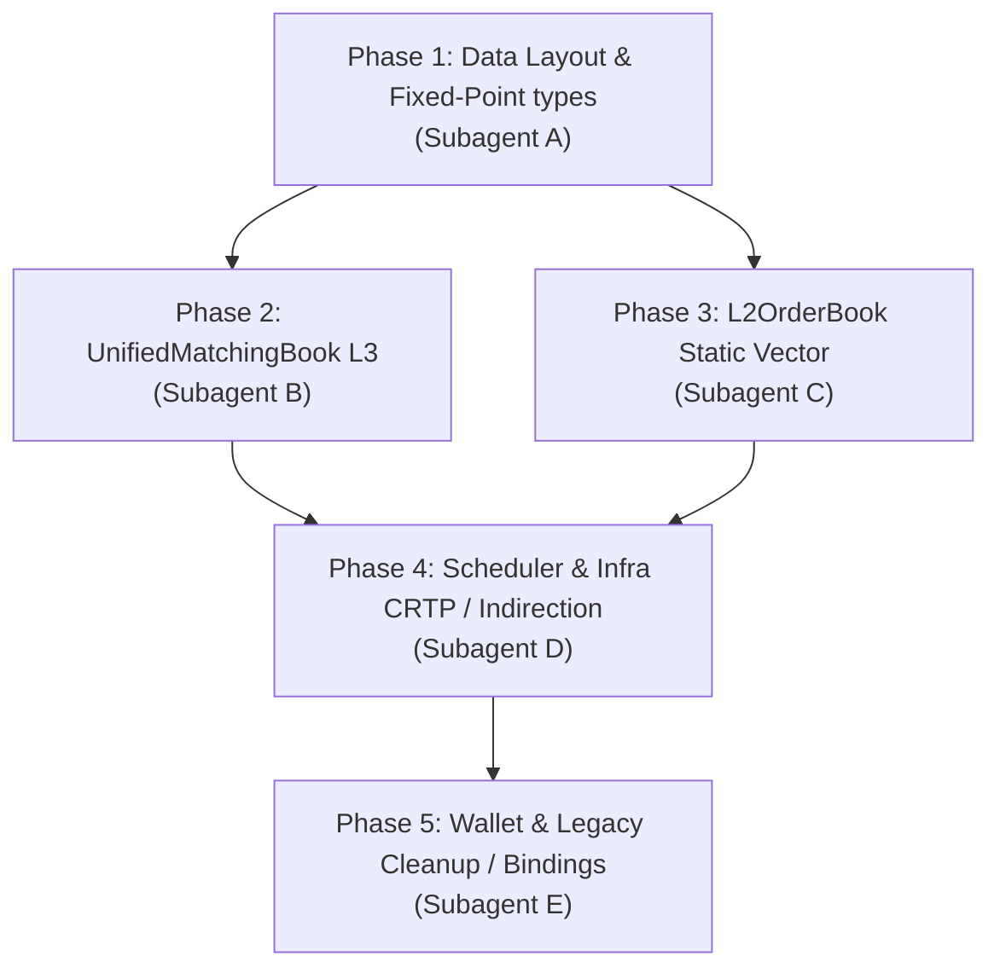

# Comprehensive Implementation Plan - YABE Codebase Refactoring

This document provides a detailed breakdown of the YABE C++20 low-latency refactoring. The tasks are divided into modular phases suitable for specialized subagents.

---

## Technical Invariants
1. **Zero dynamic allocations on the hot path**: No calls to `new`, `malloc`, `std::vector::push_back`, or map insertions in matching or event handling loop.
2. **Cache-line friendliness**: Keep data structures compact, order fields by alignment requirements (8 -> 4 -> 2 -> 1 bytes), and align structures to 32/64 bytes to prevent cache-line crossings.
3. **Fixed-point arithmetic**: Replace all `double` prices and quantities in matching, BBO, L2/L3 books, and wallets with `std::int64_t` ticks (`PriceTicks`) and `std::uint64_t` lots (`QtyLots`).
4. **Static polymorphism**: Replace virtual interfaces (like `OrderGateway`) with CRTP template wrappers to enable compile-time inlining.

---

## Phase Breakdown & Subagent Assignment



---

### Phase 1: Data Layout Optimization & Fixed-Point Types
**Assigned to:** `Subagent A (Data Layout Architect)`

#### Requirements:
- Transition prices and quantities to integers: `PriceTicks` (`std::int64_t`) and `QtyLots` (`std::uint64_t`).
- Sort structure fields by alignment requirements (8-byte fields first, then 4, 2, 1) to eliminate compiler padding.
- Apply `alignas(32)` or `alignas(64)` as specified.

#### Target Files & Layout Specs:

1. **[event_l2_update.hpp](file:///Users/danilamalafeev/Documents/YABE/include/lob/event_l2_update.hpp)**
   ```cpp
   struct alignas(32) L2UpdateEvent {
       std::uint64_t timestamp_ns {};
       std::int64_t price {};       // PriceTicks
       std::uint64_t qty {};        // QtyLots
       bool is_snapshot {};
       bool is_bid {};
   };
   static_assert(sizeof(L2UpdateEvent) == 32);
   ```

2. **[PolymarketFeedAdapter.hpp](file:///Users/danilamalafeev/Documents/YABE/include/lob/PolymarketFeedAdapter.hpp)**
   ```cpp
   struct alignas(32) PolymarketL2Update {
       std::uint64_t timestamp_ns {};
       std::uint64_t new_size {};   // QtyLots
       MarketId market_id {};       // 4 bytes
       TokenId token_id {};         // 4 bytes
       Side side {Side::Buy};       // 1 byte
       PriceCents price_cents {};   // 1 byte
       bool is_snapshot {};         // 1 byte
   };
   static_assert(sizeof(PolymarketL2Update) == 32);
   ```

3. **[order_gateway.hpp](file:///Users/danilamalafeev/Documents/YABE/include/lob/order_gateway.hpp)**
   ```cpp
   struct alignas(8) FillEvent {
       std::uint64_t order_id {};
       std::int64_t price {};       // PriceTicks
       std::uint64_t quantity {};    // QtyLots
       std::uint64_t timestamp {};
       AssetID asset_id {};         // 2 bytes
       Side side {Side::Buy};       // 1 byte
       LiquidityRole liquidity_role {LiquidityRole::Maker}; // 1 byte
   };
   static_assert(sizeof(FillEvent) == 40);
   ```

4. **[oms.hpp](file:///Users/danilamalafeev/Documents/YABE/include/lob/oms.hpp)**
   ```cpp
   struct alignas(64) OrderRequest {
       std::uint64_t quantity {};    // QtyLots
       std::uint64_t timestamp {};
       std::int64_t price {};       // PriceTicks
       std::int64_t expected_price {}; // PriceTicks
       double slippage_tolerance {}; // 8 bytes (percentage ratio, remains double)
       AssetID asset_id {};         // 2 bytes
       Side side {Side::Buy};       // 1 byte
   };
   static_assert(sizeof(OrderRequest) == 64);

   struct alignas(64) OrderExecutionReport {
       std::int64_t expected_price {};  // PriceTicks
       std::int64_t vwap_price {};      // PriceTicks
       std::uint64_t requested_quantity {}; // QtyLots
       std::uint64_t filled_quantity {};    // QtyLots
       AssetID asset_id {};             // 2 bytes
       Side side {Side::Buy};           // 1 byte
       bool fully_filled {};            // 1 byte
       bool slippage_breached {};       // 1 byte
   };
   static_assert(sizeof(OrderExecutionReport) == 64);
   ```

---

### Phase 2: UnifiedMatchingBook (L3 CLOB)
**Assigned to:** `Subagent B (Matching Engine Engineer)`

#### Requirements:
- Overhaul `lob::sim::MatchingBook` in **[matching_book.hpp](file:///Users/danilamalafeev/Documents/YABE/include/lob/sim/matching_book.hpp)** to eliminate allocations and linear index lookups.
- **Index-based Free List**: Maintain `std::array<std::uint16_t, OrderCapacity> free_slots_` with a top pointer `free_slots_ptr_` to fetch and return inactive slots in `orders_` array in $O(1)$ time.
- **Dual Search Policy**:
  - For small books (`PriceLevelCapacity <= 32`): Use a simple linear scan over active levels.
  - For deep books: Implement a flat hash map (or static index lookup) for $O(1)$ level lookup + a sorted index array of level pointers for fast sorted iteration.
- **Robin Hood Hashing with Backward Shift Deletion**:
  - Replace tombstone-based closed hash table.
  - Upon deletion, shift subsequent items backward until an item with PSL (Probe Sequence Length) = 0 or an empty bucket is met, keeping the probe sequence clean and preventing search degradation.

---

### Phase 3: L2OrderBook Optimization
**Assigned to:** `Subagent C (Order Book Engineer)`

#### Requirements:
- Replace `std::vector<Level>` inside **[l2_order_book.hpp](file:///Users/danilamalafeev/Documents/YABE/include/lob/l2_order_book.hpp)** with a custom stack-allocated `StaticVector<T, Capacity>` wrapper.
- `StaticVector` must support standard `std::vector` methods (`begin`, `end`, `size`, `empty`, `insert`, `erase`, `push_back`, `pop_back`) but run on preallocated stack storage.
- Implement **Linear Search Policy**: When `size() <= 16`, bypass binary search (`std::lower_bound`) and use a linear scan.
- Ensure all prices/quantities inside levels are integers.

---

### Phase 4: Scheduler and Infrastructure Refactoring
**Assigned to:** `Subagent D (Infrastructure Engineer)`

#### Requirements:
- **OrderGateway CRTP**:
  - Modify `OrderGateway` in **[order_gateway.hpp](file:///Users/danilamalafeev/Documents/YABE/include/lob/order_gateway.hpp)**:
    ```cpp
    template <typename Derived>
    class OrderGateway { ... };
    ```
  - Templatize `Strategy` and `L2Strategy` on the gateway type so they can make direct inline gateway calls:
    ```cpp
    template <typename Gateway>
    class Strategy { ... };
    ```
- **PendingOrderMinHeap Indirection**:
  - Refactor the min-heap inside **[backtest_engine.hpp](file:///Users/danilamalafeev/Documents/YABE/include/lob/backtest_engine.hpp)**, **[l2_backtest_engine.hpp](file:///Users/danilamalafeev/Documents/YABE/include/lob/l2_backtest_engine.hpp)**, and **[multi_asset_backtest_engine.hpp](file:///Users/danilamalafeev/Documents/YABE/include/lob/multi_asset_backtest_engine.hpp)**.
  - Store `PendingOrder` structures in a static flat array, and run the heap logic (swap/sift-up/sift-down) on an array of `std::uint16_t` indices pointing to the storage.
- **EventMerger Array Heap**:
  - Refactor **[event_merger.hpp](file:///Users/danilamalafeev/Documents/YABE/include/lob/event_merger.hpp)**:
  - Replace `std::priority_queue` with `std::array<HeapNode, N>` and manage sorting via `std::push_heap` / `std::pop_heap`.
- **Direct Addressing in ReplaySequenceValidator**:
  - Replace `std::unordered_map` in **[venue_replay.hpp](file:///Users/danilamalafeev/Documents/YABE/include/lob/venue_replay.hpp)** with a flat `std::array<ProductState, MaxVenues * MaxProducts>` (e.g. `MaxVenues = 16`, `MaxProducts = 256`).

---

### Phase 5: Wallet Optimization & Legacies Deprecation
**Assigned to:** `Subagent E (System Integrator)`

#### Requirements:
- **Wallet Optimization**:
  - Refactor **[dynamic_wallet.hpp](file:///Users/danilamalafeev/Documents/YABE/include/lob/dynamic_wallet.hpp)** to represent integer balances in a flat `std::array<std::int64_t, MaxAssets>` instead of `std::vector<double>`.
  - Cache effective liquidation factors to quote currency on edge/price updates to make `mark_to_market_nav` and `get_total_inventory_risk` runs $O(1)$ instead of performing graph traversals on every call.
- **Legacy Cleanup**:
  - Completely delete `lob::OrderBook` (Red-Black Trees / std::list) and legacy `lob::Wallet`.
  - Rename `DynamicWallet` to `Wallet`.
- **System Integration**:
  - Update `main_backtest.cpp`, `bindings.cpp`, and test suites to resolve all compilation errors arising from type conversions and templated strategies.

---

## Verification Plan

### Automated Unit & Benchmark Tests
- Compile and run tests to ensure correctness:
  ```bash
  rm -rf build-release && cmake -B build-release -DCMAKE_BUILD_TYPE=Release && cmake --build build-release
  ./build-release/lob_tests
  ```
- Run benchmarks to verify latency improvements:
  ```bash
  ./build-release/lob_benchmarks
  ```
