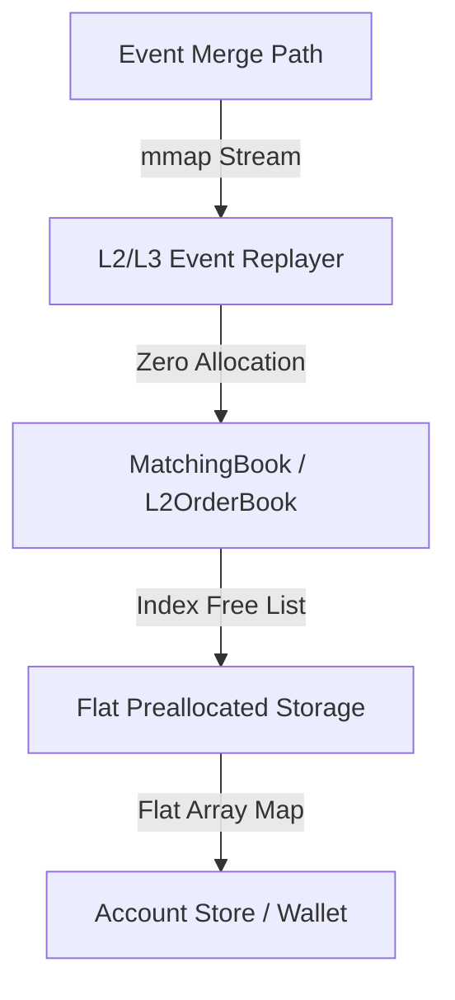

# YABE Architecture & Low-Latency Invariants

YABE (Yet Another Backtest Engine) is a C++20 quantitative execution engine designed for high-frequency trading (HFT) strategy simulation, L2/L3 order book replay, and multi-asset arbitrage search. To sustain throughputs exceeding 7M events per second (EPS) on commodity hardware, the system enforces strict low-latency design invariants.

---

## 1. Zero-Allocation Hot Path

Any heap allocation (`malloc`, `operator new`, resizing a `std::vector`) triggers system calls, lock contention, and cache pollution, making it unusable on the hot execution path. YABE solves this by pre-allocating all memory at startup.

### Pre-allocated Buffers and Pools
* **Flat Arrays**: Memory for active orders, price levels, and accounts is allocated in contiguous arrays at startup.
* **Indices instead of Pointers**: Objects reference each other via 16-bit or 32-bit array indexes (`std::uint16_t` / `std::uint32_t`) rather than raw 64-bit pointers. This keeps data dense, improves CPU cache utilization, and simplifies copying.
* **Inline Stack Allocation**: Intermediate structures used during matching utilize `StaticVector`—a custom vector container allocating elements inline without calling the heap.



---

## 2. Memory Alignment & Cache Invariants

To maximize memory bandwidth, key structures are designed to eliminate compiler padding and are cache-line aligned. This prevents **false sharing** and minimizes L1/L2 cache misses by ensuring objects fit exactly into cache lines (usually 64 bytes).

### Cache-Aligned Structures

1. **`L2UpdateEvent`** ([event_l2_update.hpp](file:///Users/danilamalafeev/Documents/YABE/include/lob/event_l2_update.hpp#L7-L14))
   * **Size**: Exactly 32 bytes (fits exactly two per 64-byte cache line).
   * **Alignment**: `alignas(32)`
   * **Fields ordered**:
     ```cpp
     struct alignas(32) L2UpdateEvent {
         std::uint64_t timestamp_ns {}; // 8 bytes
         std::int64_t price {};         // 8 bytes (PriceTicks)
         std::uint64_t qty {};          // 8 bytes (QtyLots)
         bool is_snapshot {};           // 1 byte
         bool is_bid {};               // 1 byte
         // 6 bytes padding inserted by compiler internally (total 32 bytes)
     };
     ```

2. **`OrderRequest` & `OrderExecutionReport`** ([oms.hpp](file:///Users/danilamalafeev/Documents/YABE/include/lob/oms.hpp#L14-L35))
   * **Size**: Exactly 64 bytes (fits exactly one cache line).
   * **Alignment**: `alignas(64)`
   * **Structure**:
     ```cpp
     struct alignas(64) OrderRequest {
         std::uint64_t quantity {};       // 8 bytes
         std::uint64_t timestamp {};      // 8 bytes
         std::int64_t price {};           // 8 bytes
         std::int64_t expected_price {};  // 8 bytes
         double slippage_tolerance {};    // 8 bytes
         AssetID asset_id {};             // 4 bytes
         Side side {Side::Buy};           // 1 byte
         // 19 bytes padding to hit 64 bytes
     };
     ```

3. **`FillEvent`** ([order_gateway.hpp](file:///Users/danilamalafeev/Documents/YABE/include/lob/order_gateway.hpp#L24-L33))
   * **Size**: Exactly 40 bytes.
   * **Alignment**: `alignas(8)`

---

## 3. Fixed-Point Scaling ($10^8$ Standards)

Floating-point numbers (`double`, `float`) introduce non-deterministic rounding errors, which are unacceptable for matching engines and accounting logs. Double arithmetic is also slower and can lead to precision loss when accumulating large volumes.

YABE scales all price and quantity values to fixed-point integers at ingestion using a scaling factor of **$10^8$**:

$$\text{FixedPointValue} = \text{static\_cast<std::int64\_t>}(\text{std::llround}(\text{double\_value} \times 100{,}000{,}000.0))$$

### Standard Scale Types
* **`PriceTicks` (`std::int64_t`)**: Normalized price representation.
* **`QtyLots` (`std::uint64_t`)**: Normalized quantity representation.

### Safe Arithmetic Helper Primitives
* **Double to Integer**:
  ```cpp
  static inline constexpr double kScaleDouble = 100'000'000.0;
  static inline constexpr std::int64_t kScaleInt = 100'000'000LL;

  static inline constexpr std::int64_t to_ticks(double double_val) noexcept {
      return static_cast<std::int64_t>(std::llround(double_val * kScaleDouble));
  }
  ```
* **Integer to Double**:
  ```cpp
  static inline constexpr double to_double(std::int64_t ticks) noexcept {
      return static_cast<double>(ticks) / kScaleDouble;
  }
  ```
* **Asset Exposure and Cash Sizing**:
  All wallet assets are scaled by $10^8$, avoiding any double-based rounding anomalies on the hot paths. Fees are calculated with integer division and ceiling rounding:
  
  $$\text{FeeLots} = \frac{\text{QtyLots} \times \text{FeeBps} + 9999}{10{,}000}$$

---

## 4. Zero-Allocation Container Design: `StaticVector`

The C++ standard `std::vector` dynamically allocates memory on the heap when expanding. To bypass this, YABE implements a custom container `StaticVector<T, Capacity>` ([l2_order_book.hpp](file:///Users/danilamalafeev/Documents/YABE/include/lob/l2_order_book.hpp#L12-L97)).

### Key Features of `StaticVector`
* **Stack/Inline Storage**: Elements are stored inside a contiguous `std::array<T, Capacity>` within the object structure.
* **STL Interface Compatibility**: Implements `begin()`, `end()`, `push_back()`, `pop_back()`, `insert()`, `erase()`, and `size()`.
* **Zero Overhead**: Bypasses any dynamic resizing or memory tracking overhead.

---

## 5. Interface Devirtualization (CRTP)

To abstract order placement interfaces (e.g. between L2 and L3 replayers) without incurring virtual table pointer-chasing and runtime dispatch overhead, YABE utilizes the **Curiously Recurring Template Pattern (CRTP)** ([order_gateway.hpp](file:///Users/danilamalafeev/Documents/YABE/include/lob/order_gateway.hpp#L37-L92)).

### The `OrderGateway` Class

Instead of a virtual base class, `OrderGateway` is template-parameterized by its derived implementation class:

```cpp
template <typename Derived>
class OrderGateway {
public:
    [[nodiscard]] std::uint64_t submit_order(AssetID asset_id, Side side, double price, std::uint64_t quantity, std::uint64_t timestamp) {
        return derived().submit_order_impl(asset_id, side, price, quantity, timestamp);
    }
private:
    [[nodiscard]] Derived& derived() noexcept {
        return static_cast<Derived&>(*this);
    }
};
```

This ensures that the compiler resolves the method call statically at compile time, enabling **inlining** of order submissions and completely eliminating the cost of virtual method tables (VMT).
