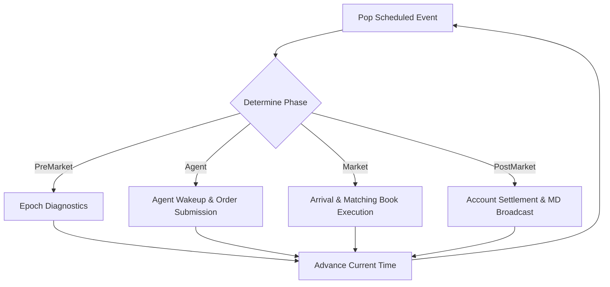

# YABE Agent-Based Simulation Engine

YABE features a closed-loop, discrete event simulation framework located under `lob::sim` ([simulation_engine.hpp](file:///Users/danilamalafeev/Documents/YABE/include/lob/sim/simulation_engine.hpp#L39)). It enables competing virtual trading agents to place, modify, and cancel orders in a central matching engine under realistic network latency, jitter, and strict margin invariants.

---

## 1. The Discrete Event Scheduler

The simulation state is driven entirely by an optimized event queue implemented in `lob::sim::EventScheduler` ([event_scheduler.hpp](file:///Users/danilamalafeev/Documents/YABE/include/lob/sim/event_scheduler.hpp#L14)), which orders and triggers events deterministically.

### Scheduling Priority

Events are sorted inside a binary min-heap utilizing a multi-level comparison policy to guarantee execution determinism:

1. **`timestamp_ns`**: Events with lower timestamps execute first.
2. **`EventPhase`**: If timestamps match, events are ordered by their discrete execution phase:
   * **`PreMarket` (0)**: System maintenance, epoch checks.
   * **`Agent` (1)**: Agents wake up, receive private updates, and submit actions.
   * **`Market` (2)**: Actions (orders/cancels) arrive at the matching engine and execute.
   * **`PostMarket` (3)**: Position updates, settlements, and public feeds broadcast.
3. **`sequence_number`**: An auto-incrementing sequence number acts as a final tie-breaker, guaranteeing strict FIFO order and eliminating platform-dependent sorting non-determinism.



---

## 2. Latency & Jitter Channels

YABE realistically models network routing delays and matching engine processing queues using statistical distributions defined in `lob::sim::LatencyModel` ([latency_model.hpp](file:///Users/danilamalafeev/Documents/YABE/include/lob/sim/latency_model.hpp#L18)).

### Supported Distributions
* **`Fixed`**: A constant, deterministic delay:
  
  $$\text{Latency} = \text{base\_latency\_ns}$$

* **`Uniform`**: Jitter bounded within a range:
  
  $$\text{Latency} = \text{base\_latency\_ns} + \text{sample\_uniform}(0, \text{jitter\_bound\_ns})$$

* **`Exponential`**: Simulates queuing delays:
  
  $$\text{Latency} = \text{base\_latency\_ns} + \text{sample\_exponential}(\text{mean})$$

* **`LogNormal`**: Models WAN network latency:
  
  $$\text{Latency} = \text{base\_latency\_ns} + \text{sample\_lognormal}(\mu, \sigma)$$

### Determinism Invariant
Each latency channel maintains its own LCG state (`rng_state_`). This guarantees that given the same seed, the exact sequence of network jitters and order arrival crossings will be reproduced identically across simulation runs.

---

## 3. Agent Model & `AgentContext` Facade

Virtual participants subclass `lob::sim::MarketAgent` ([market_agent.hpp](file:///Users/danilamalafeev/Documents/YABE/include/lob/sim/market_agent.hpp)), which implements the following callbacks:
* **`on_start()`**: Invoked during simulation initialization.
* **`on_wakeup()`**: Fired when a scheduled agent timer expires.
* **`on_fill()`**: Fired when the agent's resting order receives a partial or full fill.
* **`on_cancel()`**: Fired when a cancel request succeeds.

### Safe Facade Design

To prevent agents from maliciously accessing other agents' balances, inspecting the global matching book state, or modifying simulation schedules, agents interact with the engine exclusively through the `AgentContext` facade ([agent_context.hpp](file:///Users/danilamalafeev/Documents/YABE/include/lob/sim/agent_context.hpp)):

```cpp
template <typename Engine>
class AgentContext {
public:
    // Safe exposed primitives
    [[nodiscard]] std::uint64_t submit_limit(MarketID market, Side side, PriceTicks price, QtyLots qty, TimeInForce tif);
    [[nodiscard]] bool cancel_order(MarketID market, OrderID order_id);
    [[nodiscard]] bool schedule_wakeup(TimeNs delay_ns);
    [[nodiscard]] std::optional<AccountBalance> balance(AssetID asset) const;
    [[nodiscard]] TimeNs current_time() const;
};
```

---

## 4. Accounting, Margin, and Reservations

The `AccountStore` ([account_store.hpp](file:///Users/danilamalafeev/Documents/YABE/include/lob/sim/account_store.hpp#L33)) tracks assets (USDT, BTC, ETH, etc.) for all registered agents. Sizing safety is maintained through a strict **double-entry reservation** pattern.

### Double-Entry Reservation Rules

1. **Submission Reservation**: When an agent submits a buy limit order of size $Q$ lots at price $P$ ticks:
   * The required quote asset amount $P \times Q$ is computed in fixed-point lots.
   * This amount is reserved immediately:
     
     $$\text{available\_lots} \leftarrow \text{available\_lots} - (P \times Q)$$
     
     $$\text{reserved\_lots} \leftarrow \text{reserved\_lots} + (P \times Q)$$
     
   * If `available_lots` is insufficient, the order is rejected immediately at submission time, preventing credit/margin defaults.
2. **Release on Cancel**: If the order is canceled, the unused reservation is returned to availability:
   
   $$\text{available\_lots} \leftarrow \text{available\_lots} + \text{unused\_reservation}$$
   
   $$\text{reserved\_lots} \leftarrow \text{reserved\_lots} - \text{unused\_reservation}$$

3. **Settlement Consumption**: When a trade matches (e.g. buyer matches seller for quantity $q$ lots at price $p$ ticks):
   * The matching engine fires a settlement event.
   * The buyer's reserved quote asset is consumed:
     
     $$\text{reserved\_lots\_quote} \leftarrow \text{reserved\_lots\_quote} - (p \times q)$$
     
   * The buyer receives the base asset:
     
     $$\text{available\_lots\_base} \leftarrow \text{available\_lots\_base} + q$$
     
   * The seller's base asset reservation is consumed, and the seller receives the quote asset (minus exchange fees).
